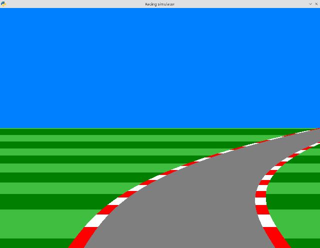

# Python racing simulator

> This project was moved to [my private git server](https://git.ichibi.eu/penguin86/python-sdl-racing-sim) . This repository may not be up to date.
> This is a personal project, probably of little use for others, and I don't currently accept contributions on it. Anyway, feel free to contact me if you have any idea.

A simple racing simulator similar to the ones in the '80s. Inspired by [OneLoneCoder's one](https://www.youtube.com/watch?v=KkMZI5Jbf18). Written in python and SDL.

## Missing/TODO:

Add a car (WIP)

## Assets attribution

Car image by Image by [OpenClipart-Vectors](https://pixabay.com/users/openclipart-vectors-30363/?utm_source=link-attribution&amp;utm_medium=referral&amp;utm_campaign=image&amp;utm_content=1293964) from [Pixabay](https://pixabay.com//?utm_source=link-attribution&amp;utm_medium=referral&amp;utm_campaign=image&amp;utm_content=1293964)
